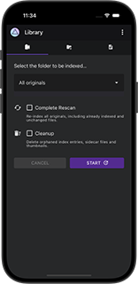

# First Steps 👣

Once the [initial setup](../getting-started/index.md) is complete, there are only two more steps before you can start browsing your pictures:

1.  Configure [your library](settings/library.md) and [advanced settings](settings/advanced.md) according to your individual preferences.
2. Choose [whether you want](library/index.md) to [index your originals directly](library/originals.md), leaving all file and folder names unchanged, or use the [optional import feature](library/import.md), which automatically removes duplicates, gives files a unique name, and sorts them by year and month.

If you want to use folders that already exist on your computer, make sure you configured them as *originals* respectively *import* folders during setup.

To add new pictures, you can either copy them to the *originals* or *import* folder, for example [using WebDAV](sync/webdav.md), or [upload them using a browser](library/upload.md), which will automatically import them once uploaded.

Then start [indexing](library/originals.md) or [importing](library/import.md), depending on which strategy you have chosen.

!!! tldr ""
    Ensure [there is enough disk space available](../getting-started/troubleshooting/docker.md#disk-space) for creating thumbnails and [verify filesystem permissions](../getting-started/troubleshooting/docker.md#file-permissions) before starting to index: Files in the *originals* folder must be readable, while the *storage* folder including all subdirectories must be readable and writeable.

## While indexing is in progress...
[{ align=right }](library/originals.md)
Your [photos](search/index.md) and [videos](organize/video.md) will
successively become visible in search results and other parts of the user interface.
Open the *Logs* tab in *Library* to watch the indexer working.
The counts in the navigation are constantly updated, so you can follow the progress.

In case some of your pictures are still missing after indexing has been completed,
they might be in [Review](organize/review.md) due to low quality or incomplete metadata.
You can turn this and other features off in [Settings](settings/general.md),
depending on your specific use case.

Of course, you can continue using your favorite tools for processing RAW files, editing metadata,
or importing new shots. Go to *Library* and click *Start* to update the index after files have been
changed, added, or removed. This can also be automated by configuring a schedule for regular indexing using the `PHOTOPRISM_INDEX_SCHEDULE` [config option](../getting-started/config-options.md#indexing)

!!! note ""
    While indexing, JPEG sidecar files may be created for originals in other formats such as RAW and HEIF. This is required for image classification, facial recognition, and for displaying them in a Web browser. Sidecar and thumbnail files will be added to the *storage* folder, so that your *originals* folder won't be modified.

## Setting up Your Devices

Finally, once indexing is complete and you're happy with the results, you can configure [automatic syncing](sync/mobile-devices.md) from your phone and install the [Progressive Web App (PWA)](pwa.md) on your desktop and mobile home screens as needed.
