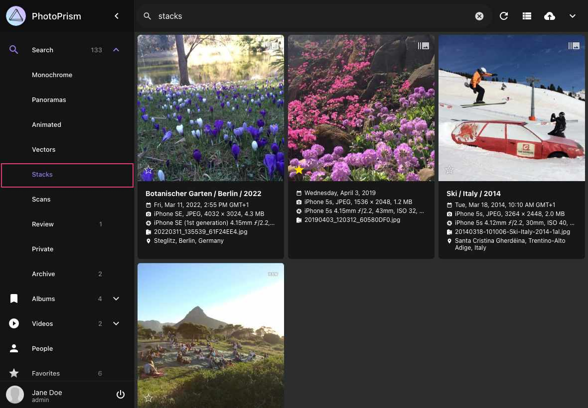
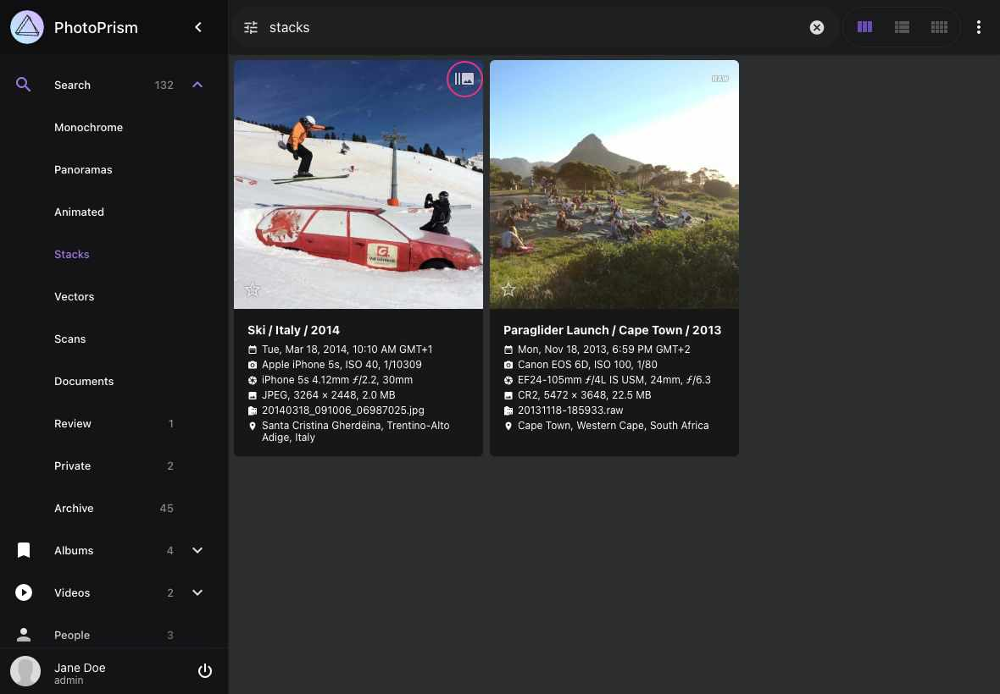
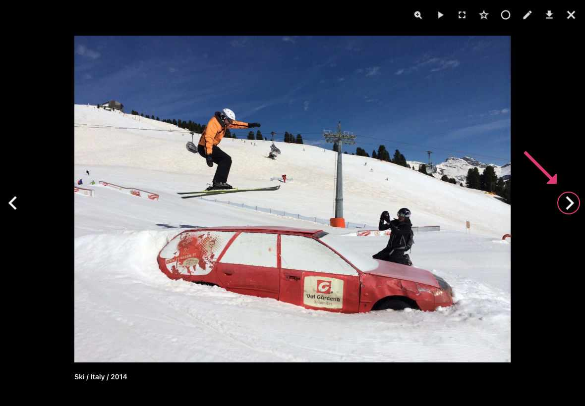
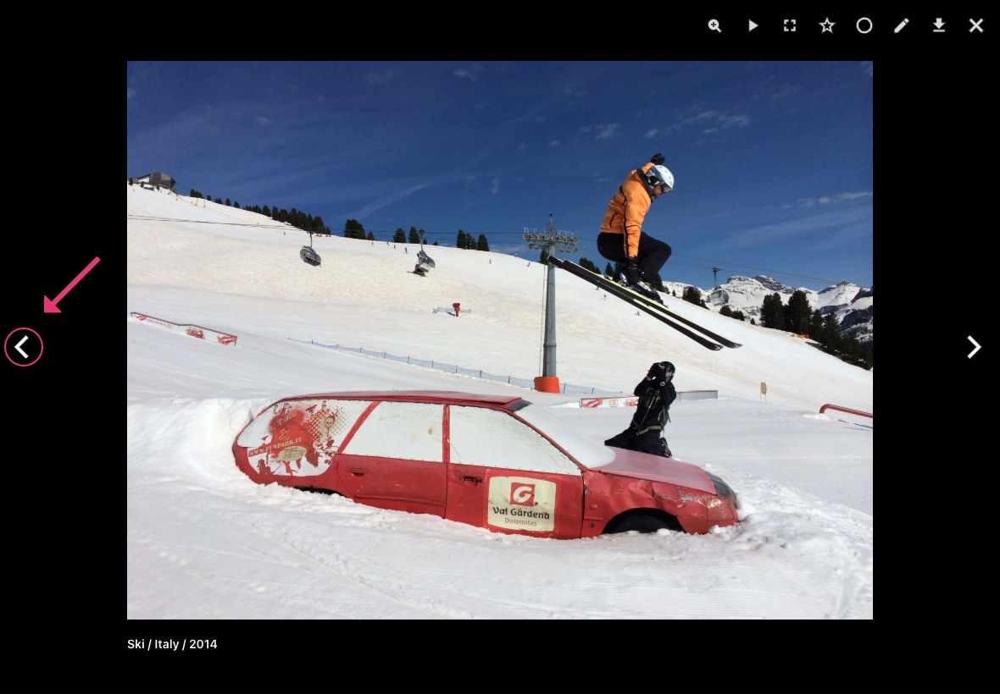
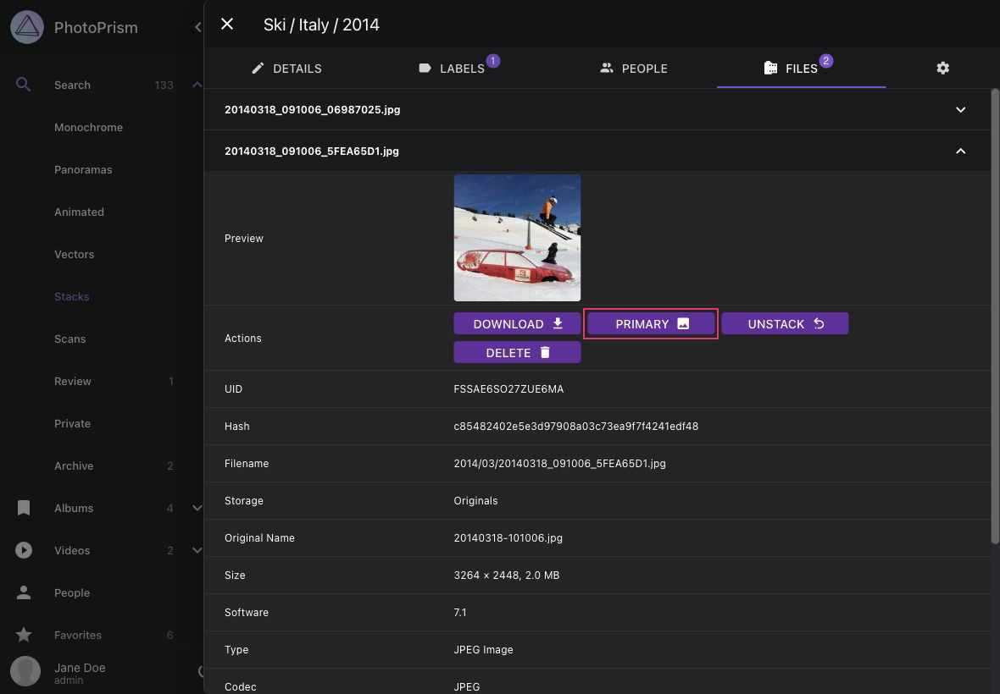
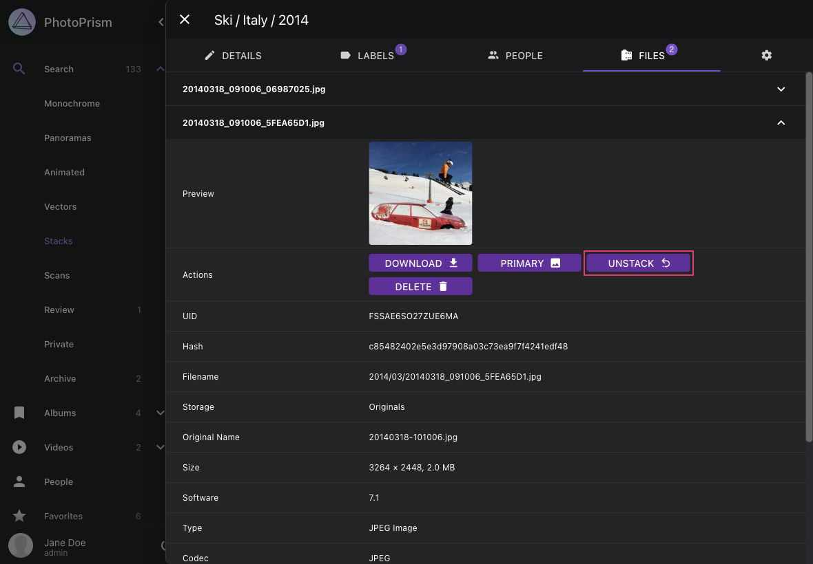
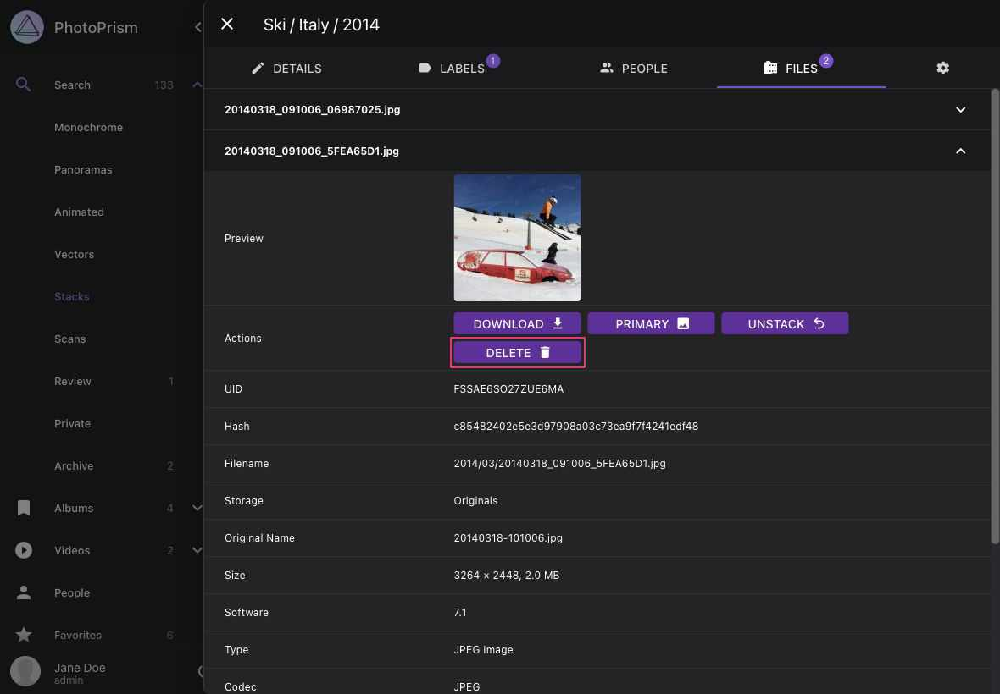

# Stacks

Stacks are groups of files that have the same origin but differ in quality, format, size, or color. Go to *[Settings > Content](../settings/library.md)* to change the stacks-related settings for your library.

To see all images with a group of related files, open *Stacks* in the expanded *Search* navigation:

{ class="shadow" }

Since [videos](video.md) and [Live Photos](video.md#live-photos) are always stacked with a still image, they are not included in the search results when you navigate to *Search > Stacks*.

### For what reasons can files be stacked?

1. Files that share the same file and folder name (except for the file extension) are always stacked, for example `/2018/IMG_1234.jpg` and `/2018/IMG_1234.avi`
2. Files with sequential names like `/2018/IMG_1234 (2).jpg` and `/2018/IMG_1234 (3).jpg` can be stacked as well (optional)
3. File metadata indicates that the pictures were taken at the same position within the same second (optional)
4. File metadata includes the same *Unique Image ID* or *XMP Instance ID* (optional)

You can change your preferences for 2 - 4 in the *Stacks* section under *[Settings > Content](../settings/library.md#stacks)*.

!!! note ""
    Note that it is **not possible to disable stacking of files with the same name** as this would break important functionality, most notably support for Apple [Live Photos](video.md#live-photos) (which consist of a photo and a video file), any other multi-file/hybrid formats like RAW/JPEG, and indexing of metadata from XMP/JSON sidecar files.

### Are files automatically unstacked when I change the settings?

When you change the stacks-related settings under [*Settings > Content*](../settings/library.md#stacks), files that are already stacked will **not be unstacked automatically**. This is because unstacking is a resource-intensive operation that requires each file to be re-indexed.

The result also depends on the exact order in which you unstack the files, as non-media sidecar files, for example, remain bound to the remaining media file in a stack. We consider providing a command for this in a future release and appreciate [any contributions](../../developer-guide/index.md) in this regard.

!!! tldr ""
    If you are new to PhotoPrism and want to re-index your library with different settings, you can run the `photoprism reset` [command in a terminal](../../getting-started/docker-compose.md#command-line-interface) to reset the index and start from scratch. [Learn more ›](../../getting-started/docker-compose.md#examples)

### Which sequential naming patterns are supported?

If stacking by *Sequential Name* [has been enabled](../settings/library.md#stacks), files with e.g. the following names would be stacked with the file `/2018/IMG_1234.jpg`:

- `/2018/IMG_1234 (2).jpg` `/2018/IMG_1234 (3).jpg`
- `/2018/IMG_1234 copy.jpg` `/2018/IMG_1234 copy 1.jpg` `/2018/IMG_1234 copy 2.jpg`
- `/2018/IMG_1234 (-2.7)` `/2018/IMG_1234 (+3.3).jpg` `/2018/IMG_1234(-2.7).jpg`  `/2018/IMG_1234(+3.3).jpg`

## Browse Related Files

1. Click on :material-camera-burst:

    { class="shadow" }
    
2. Use arrows to see all photos of the sequence

    { class="shadow" } { class="shadow" }
   

## Change Primary Files

The JPEG file marked as *primary* is used in our views. It is listed first in the files tab.

To change the primary file:

1. Open the photos [*edit dialog*](edit.md)

2. Open *Files* tab

3. Click :material-chevron-down: of the file you want to set as primary
        
4. Click *primary*

      { class="shadow" } 

## Unstack Files

1. Open the photos [*edit dialog*](edit.md)

2. Open *Files* tab

3. Click :material-chevron-down: of the JPEG file that is not marked as primary
        
4. Click *unstack*

   { class="shadow" }

Now, both files appear in our views.

{ class="shadow" }

## Delete Non-Primary Files

1. Open the photos [*edit dialog*](edit.md)

2. Open *Files* tab

3. Click :material-chevron-down: of the JPEG file that is not marked as primary
        
4. Click *delete*

5. Confirm

   { class="shadow" } 

*[same position]: GPS latitude and longitude